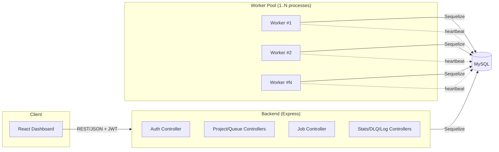
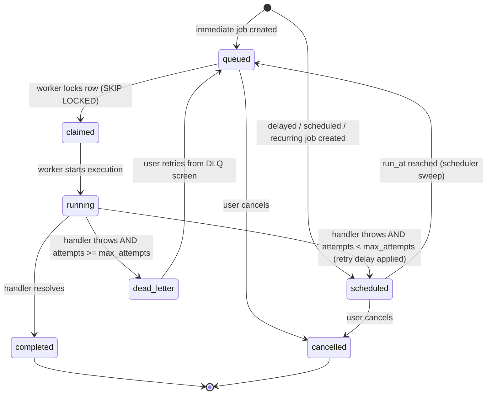

# Architecture

## Overview

The system is split into three independently runnable Node.js applications that
share one MySQL database:

| App        | Responsibility                                                              |
|------------|------------------------------------------------------------------------------|
| `backend`  | REST API — auth, projects, queues, jobs, retry policies, stats, DLQ, logs   |
| `worker`   | Polls the database, claims jobs atomically, executes them, retries/DLQs    |
| `frontend` | React + Tailwind dashboard that talks to the backend over HTTP             |

There is no message broker (RabbitMQ/Kafka/Redis) — MySQL itself is the queue.
Jobs are rows in the `jobs` table; "enqueueing" is an `INSERT`, "claiming" is a
locked `SELECT ... FOR UPDATE SKIP LOCKED` inside a transaction, and "acking"
is an `UPDATE` of the row's status. This keeps the whole stack to a single
database dependency, which is intentional for a project of this scope (see
`DESIGN_DECISIONS.md`).

## Component diagram

## Job lifecycle

## Concurrency & safety

* Each worker process claims a batch of jobs inside **one transaction** using
  `SELECT ... FOR UPDATE SKIP LOCKED`, so two workers polling at the same
  moment can never claim the same row — this is what "atomic claim" means in
  the requirements.
* Per-queue `concurrency_limit` is enforced in that same transaction by
  counting rows already `running`/`claimed` for that queue before claiming
  more, so a queue configured for 3 concurrent jobs never exceeds 3 regardless
  of how many workers are polling it.
* A worker's own in-process concurrency (`WORKER_CONCURRENCY`) caps how many
  jobs one process executes in parallel with `Promise`-based async execution
  (no threads/child processes needed since job handlers are I/O-bound).

## Scheduling (delayed / scheduled / recurring)

A lightweight sweep (`worker/src/scheduler.js`) runs on the same interval as
polling and does two things:

1. Promotes any `scheduled` job whose `run_at <= NOW()` to `queued` so the
   normal claim loop picks it up.
2. For active `ScheduledJob` templates (used by recurring jobs), materializes
   a new `Job` row once `next_run_at` has passed, then advances
   `next_run_at` using the job's cron expression (via `cron-parser`).

This avoids needing a separate cron daemon — any running worker process can
perform the sweep, and duplicate materialization is avoided because the
template's `next_run_at` is updated in the same pass that creates the job.
