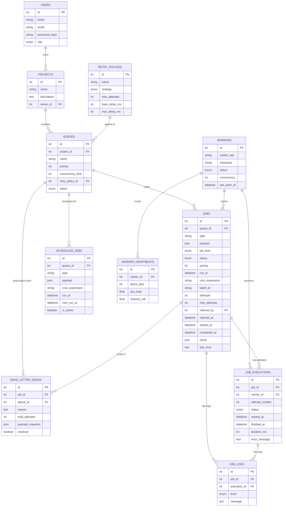

# Entity-Relationship Diagram

```mermaid
erDiagram
    USERS ||--o{ PROJECTS : owns
    PROJECTS ||--o{ QUEUES : contains
    RETRY_POLICIES ||--o{ QUEUES : "applies to"
    QUEUES ||--o{ JOBS : holds
    QUEUES ||--o{ SCHEDULED_JOBS : "templates for"
    QUEUES ||--o{ DEAD_LETTER_QUEUE : "dead letters from"
    WORKERS ||--o{ JOBS : claims
    WORKERS ||--o{ WORKER_HEARTBEATS : "sends"
    WORKERS ||--o{ JOB_EXECUTIONS : performs
    JOBS ||--o{ JOB_EXECUTIONS : "has attempts"
    JOBS ||--o{ JOB_LOGS : "has logs"
    JOB_EXECUTIONS ||--o{ JOB_LOGS : "has logs"
    JOBS ||--o{ DEAD_LETTER_QUEUE : "lands in"

    USERS {
        int id PK
        string name
        string email
        string password_hash
        enum role
    }

    PROJECTS {
        int id PK
        string name
        text description
        int owner_id FK
    }

    RETRY_POLICIES {
        int id PK
        string name
        enum strategy
        int max_attempts
        int base_delay_ms
        int max_delay_ms
    }

    QUEUES {
        int id PK
        int project_id FK
        string name
        int priority
        int concurrency_limit
        int retry_policy_id FK
        enum status
    }

    JOBS {
        int id PK
        int queue_id FK
        string type
        json payload
        enum job_kind
        enum status
        int priority
        datetime run_at
        string cron_expression
        string batch_id
        int attempts
        int max_attempts
        int claimed_by FK
        datetime claimed_at
        datetime started_at
        datetime completed_at
        json result
        text last_error
    }

    SCHEDULED_JOBS {
        int id PK
        int queue_id FK
        string type
        json payload
        string cron_expression
        datetime run_at
        datetime next_run_at
        boolean is_active
    }

    WORKERS {
        int id PK
        string worker_key
        string hostname
        enum status
        int concurrency
        datetime last_seen_at
    }

    WORKER_HEARTBEATS {
        int id PK
        int worker_id FK
        int active_jobs
        float cpu_load
        float memory_mb
    }

    JOB_EXECUTIONS {
        int id PK
        int job_id FK
        int worker_id FK
        int attempt_number
        enum status
        datetime started_at
        datetime finished_at
        int duration_ms
        text error_message
    }

    JOB_LOGS {
        int id PK
        int job_id FK
        int execution_id FK
        enum level
        text message
    }

    DEAD_LETTER_QUEUE {
        int id PK
        int job_id FK
        int queue_id FK
        text reason
        int total_attempts
        json payload_snapshot
        boolean resolved
    }
```
